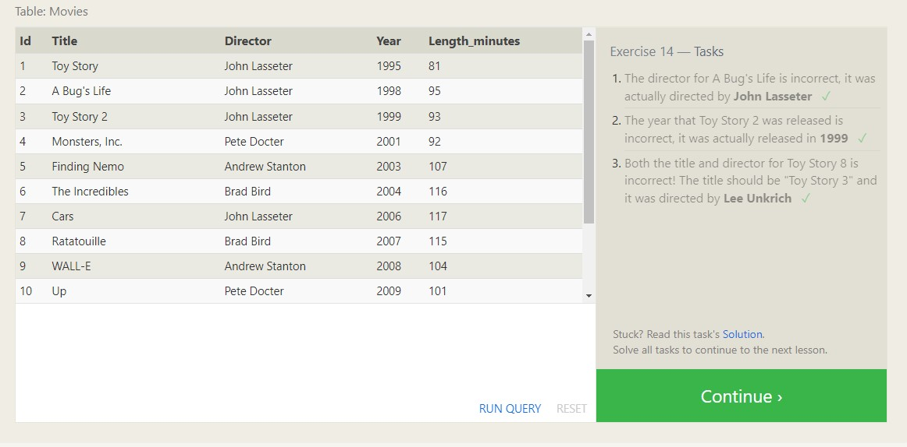

# SQL Practice

SQL (Structured Query Language) is a programming language that is used to manage and manipulate relational databases. It provides a standardized way to interact with databases, allowing users to perform various operations on the data stored in them, such as inserting, updating, deleting, and querying data.

Ex 1: 
Ex 2: 
Ex 3: 
Ex 4: 
Ex 5: 
Ex 6: 
Ex 13: 
Ex 14: 
Ex 15: 
Ex 16: 
Ex 17: 
Ex 18: 